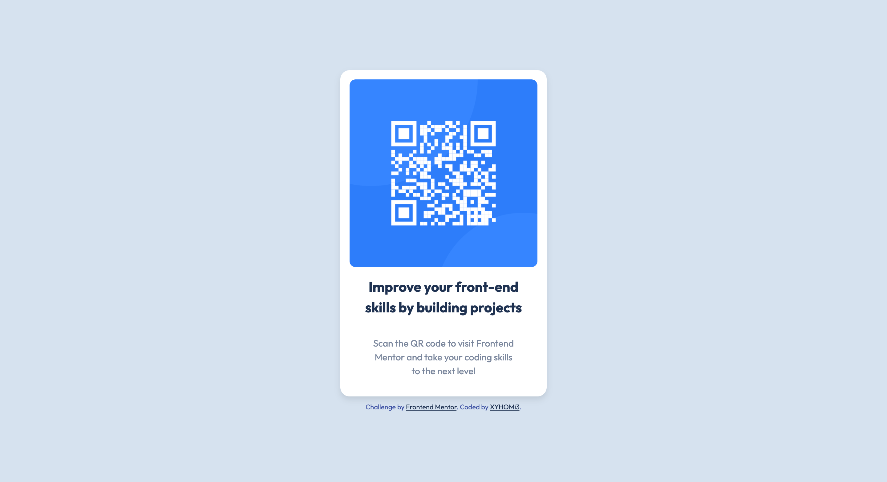

# Frontend Mentor - QR Code Component Solution

This is a solution to the [QR code component challenge on Frontend Mentor](https://www.frontendmentor.io/challenges/qr-code-component-iux_sIO_H). Frontend Mentor challenges help you improve your coding skills by building realistic projects.

  
  

## Overview

This project is a solution to the QR code component challenge. It involves creating a responsive QR code card with a title and description.

### Links

- [Solution URL]([https://your-solution-url.com](https://www.frontendmentor.io/solutions/responsive-qr-code-card-using-html-and-css-grid-81ldR3S896))
- [Live Site URL](https://xyhomi3.github.io/qr-code-component)

## My Process

### Built With

- HTML5
- CSS
- Flexbox
- CSS Grid

### What I Learned

While working on this project, I learned how to create a responsive card component using HTML and CSS. I also improved my skills in layout design and responsive web development.

### Continued Development

In future projects, I plan to focus on further improving my CSS skills and exploring more advanced layout techniques. I also want to delve deeper into JavaScript to add interactivity to my projects.

## Author

- Website - [XYHOMi3](https://xyhomi3.github.io/)
- Frontend Mentor - [@xyhomi3](https://www.frontendmentor.io/profile/xyhomi3)
- Twitter - [@xyhomi3](https://www.twitter.com/xyhomi3)

## Acknowledgments

I would like to acknowledge the Frontend Mentor community for providing this challenge and the valuable feedback and support I received from fellow developers.
